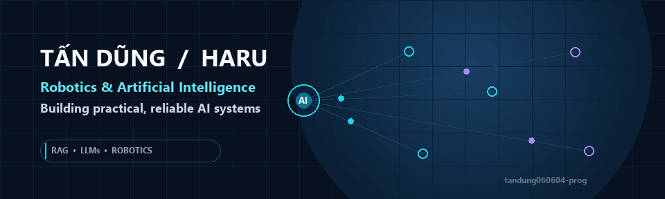
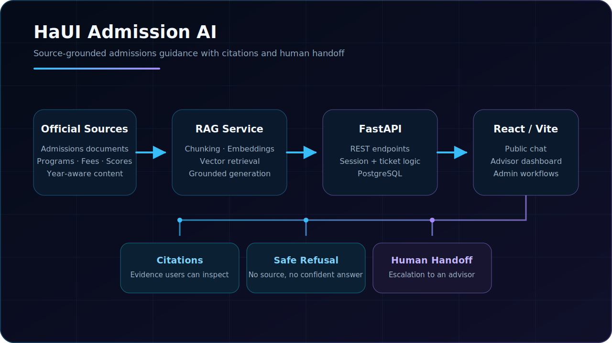

  <picture>
    <source media="(max-width: 600px)" srcset="assets/github-profile-banner-mobile.svg" />
    
  </picture>

  
  
  

## About me

I'm **Tấn Dũng (Haru)**, a recent **Robotics and Artificial Intelligence** graduate focused on turning AI concepts into practical, testable products.

I am currently learning and building with **retrieval-augmented generation (RAG), LLM applications, AI agents, and robotics**. I care about traceable data sources, citations, evaluation, and refusal behavior when the available evidence is insufficient—especially for systems where an unsupported answer would be worse than no answer.

My goal is to grow from an AI Application Developer into an **AI/Robotics Engineer** who can connect reliable AI software with real-world automation and robotic systems.

## What I'm working on

- **RAG applications** — building production-oriented retrieval and answer-generation workflows.
- **LLM evaluation** — checking responses with citations, test cases, and groundedness criteria.
- **AI agents** — exploring tool use, orchestration, guardrails, and human-in-the-loop patterns.
- **Workflow automation** — learning BPMN and Camunda 7 through hands-on systems.
- **Robotics integration** — connecting perception and AI services with embedded/mobile robots.
- **Engineering practice** — improving testing, deployment, observability, and maintainability.

## Technical toolkit

### AI & LLM

`Python` · `RAG` · `LLM Applications` · `Prompt Engineering` · `AI Agents` · `Embeddings` · `Vector Databases` · `Ragas`

### Backend & data

`FastAPI` · `REST APIs` · `PostgreSQL` · `Pydantic` · `SQLAlchemy` · `Python virtual environments`

### Frontend

`React` · `Vite` · `Next.js` · `TypeScript` · `JavaScript` · `HTML` · `CSS`

### Tools, quality & deployment

`Git` · `GitHub` · `Docker` · `Railway` · `Postman` · `VS Code` · `Codex` · `pytest` · `Camunda 7` · `BPMN`

### Robotics — evidenced in public repositories

`OpenCV` · `PyTorch` · `YOLOv8` · `DeepSORT` · `ESP32 / ESP32-CAM` · `Arduino` · `ROS / Gazebo` · `MATLAB / Simulink` · `PID / LQR control`

## Featured project

### HaUI Admission AI

An admissions assistant for Hanoi University of Industry that helps applicants and parents find information about admission methods, programs, benchmark scores, tuition, scholarships, application documents, and frequently asked questions.

**Status:** Completed

**Core architecture**

- React/Vite frontend with a FastAPI backend and PostgreSQL persistence.
- A dedicated RAG service over public, official admissions sources.
- Retrieval and answers scoped by admission year.
- Advisor/admin workflows for document management, conversation history, and handoff tickets.

**What makes it useful**

- Returns source citations with answers so users can verify important details.
- Reduces unsupported answers through grounded retrieval and refusal behavior.
- Escalates questions that need deeper guidance to a human advisor.
- Keeps admissions content manageable through an advisor/admin dashboard.

**Links:** [Live demo](https://c2-app-028.up.railway.app) · [Source repository](https://github.com/tandung060604-prog/HaUi-Admission-Chatbot)

> The demo endpoint returned the admissions interface during the July 22, 2026 audit. Availability may vary; this is not an uptime guarantee.

## Selected projects

### [Camunda Quest Academy](https://github.com/tandung060604-prog/Camunda-Quest-Academy) — Completed

A local-first learning application for Camunda 7 and BPMN with structured lessons, quizzes, workflow simulation, assessments, and certificate verification.

**Stack:** Python · FastAPI · SQLite · SQLAlchemy · Jinja2 · Camunda 7 · BPMN · pytest

### [Human-Following Mobile Robot](https://github.com/tandung060604-prog/Human-Following-Robot) — Prototype

An individual robotics project that detects and tracks a person, then sends navigation commands to an ESP32-CAM mobile robot over Wi-Fi.

**Stack:** Python · YOLOv8 · DeepSORT · OpenCV · ESP32-CAM · Arduino/C++ · ROS · Gazebo

### [ESP32 Self-Balancing Robot](https://github.com/tandung060604-prog/Esp32-self-balancing-robot) — Prototype

A two-wheeled robot exploring PID and LQR control, MPU6050 sensor fusion with a Kalman filter, and browser-based control over Wi-Fi.

**Stack:** ESP32 · Arduino/C++ · PID · LQR · Kalman filter · WebSocket · MATLAB/Simulink

### [NexaRead AI](https://github.com/tandung060604-prog/NexaRead-AI) — In Progress

A source-aware document reading foundation with asynchronous PDF processing, structured navigation, annotations, and technical-term assistance.

**Stack:** Next.js · React · TypeScript · FastAPI · PostgreSQL · Redis · MinIO · Docker

> OCR, semantic retrieval, RAG, and LLM-provider integration are planned milestones—not completed features.

## GitHub activity

Explore my [public repositories](https://github.com/tandung060604-prog?tab=repositories) and [recent public activity](https://github.com/tandung060604-prog?tab=overview). I prefer documented, inspectable project evidence over using contribution counts as a proxy for experience.

## Resume / CV

Public English and Vietnamese CVs are available below.

  
  

## Let's connect

I'm open to internships, fresher opportunities, research collaboration, and practical AI/robotics projects.

- **Email:** [tandung060604@gmail.com](mailto:tandung060604@gmail.com)
- **Instagram:** [@_saxichuongduong_](https://www.instagram.com/_saxichuongduong_/)
- **Discord:** `.harunguyen`
- **Location:** Ha Noi, Vietnam
- **GitHub:** [github.com/tandung060604-prog](https://github.com/tandung060604-prog)

Building useful AI systems, one experiment at a time.

